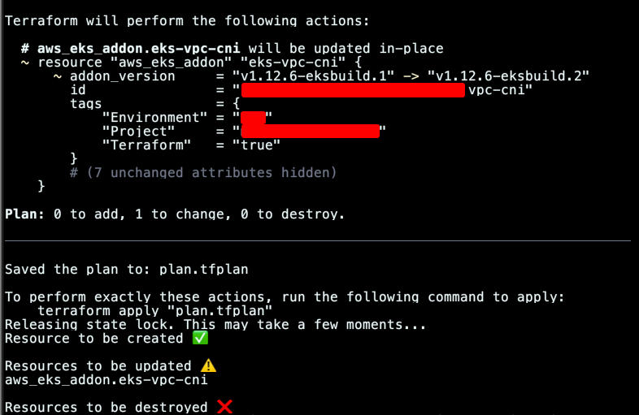
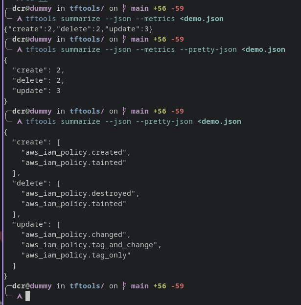

<!-- START doctoc generated TOC please keep comment here to allow auto update -->
<!-- DON'T EDIT THIS SECTION, INSTEAD RE-RUN doctoc TO UPDATE -->
**Table of Contents**  *generated with [DocToc](https://github.com/thlorenz/doctoc)*

- [Usage](#usage)
  - [Summarize](#summarize)
  - [Function for zsh or bash shell](#function-for-zsh-or-bash-shell)
- [Function for fish shell](#function-for-fish-shell)
- [Example](#example)
- [JSON output support](#json-output-support)
  - [JSON output with arns](#json-output-with-arns)
  - [JSON output only metrics](#json-output-only-metrics)
  - [JSON output pretty](#json-output-pretty)

<!-- END doctoc generated TOC please keep comment here to allow auto update -->

# Usage

## Summarize

```bash
terraform plan -out plan.tfplan
terraform show -json plan.tfplan | tftools summarize
```

Or if you have the file in json:

```bash
terraform plan -out plan.tfplan
terraform show -json plan.tfplan > plan.json
cat plan.json | tftools summarize
tftools summarize ;
```

## Function for zsh or bash shell
Copy [this function](../scripts/tfsum.sh) in your `~/.zshrc` or `~/.bashrc` file.

```bash
function tfsum() {
  if [ -z "$1" ];
  then
    echo "You should type 'tfsum terraform|terragrunt'"
  else
    echo -en "Starting tf summary... Please wait"
    # If you want to print full plan output: $1 plan -out plan.tfplan
    $1 plan -out plan.tfplan 1> /dev/null
    $1 show -json plan.tfplan | tftools summarize --show-tags
    # Delete plan out file to avoid git tracking (although is included in .gitignore)
    if [ -f "plan.tfplan" ]; then rm plan.tfplan; fi
  fi
}
```

# Function for fish shell

```shell
function tfsum
    if test -z $argv[1]
        echo "You should type 'tfsum terraform|terragrunt'"
    else
        echo -en "Starting tf summary... Please wait"
        # If you want to print full plan output: $argv[1] plan -out plan.tfplan
        $argv[1] plan -out plan.tfplan 1> /dev/null
        $argv[1] show -json plan.tfplan | tftools summarize --show-tags
        # Delete plan out file to avoid git tracking (although is included in .gitignore)
        if test -f "plan.tfplan"; rm plan.tfplan; end
    end
end
```

Load new functions:

```shell
source ~/.zshrc
source ~/.bashrc
source ~/.config/fish/config.fish
```

# Example

```shell
cd my-terraform-project/
tfsum terraform
```

Then, you will see the summarized output with the corresponding targets.

The example:

> [!NOTE]
> The following example is using the full output command

```shell
tftools summarize --show-tags --show-unchanged <Documents/plan.json
```



> Terragrunt is also supported

```shell
$ tfsum terragrunt
```

# JSON output support

## JSON output with arns
```shell
tftools summarize --json --pretty-json <demo.json
```

## JSON output only metrics

```shell
tftools summarize --json --metrics <demo.json
```

## JSON output pretty

```shell
tftools summarize --json --metrics --pretty-json <demo.json
```


